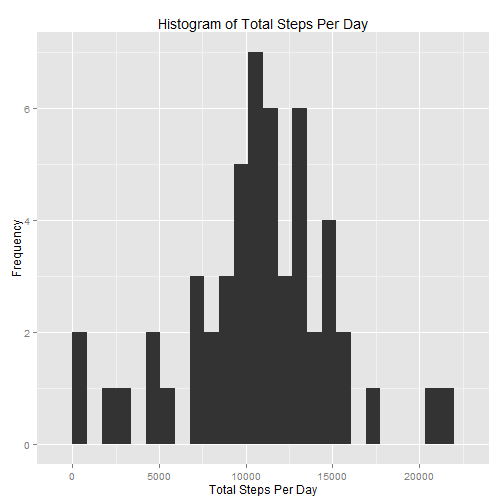
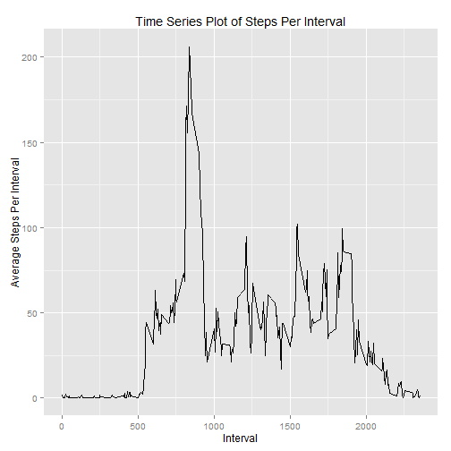
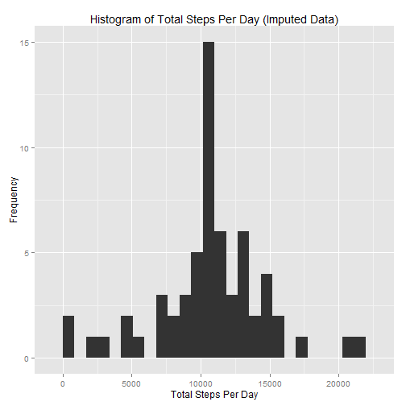
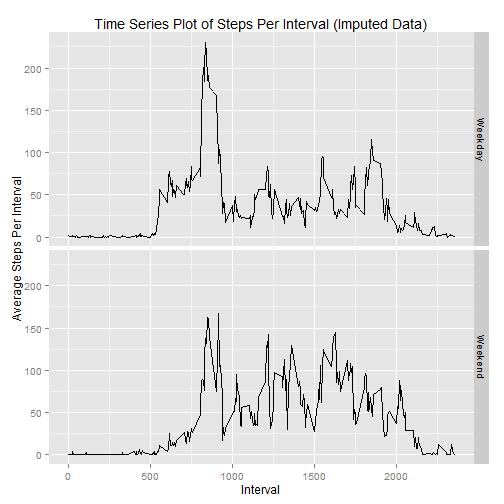

# Reproducible Research:  Peer Assessment 1
===============================================================================


## Loading and preprocessing the data
Remember to set working directory with data file prior to running R Markup  
Data file "activity.csv"" has three columns: steps, date and interval  
Need to convert date string (mm/dd/YYYY) to r date object  
Also, will make a copy without NAs for first set of analyses  


```r
library("ggplot2")
library("plyr")

data <- read.csv("activity.csv")
data$date <- as.Date(data$date, "%Y-%m-%d")
data_noNA <- data[!is.na(data$steps), ]
```

## What is mean total number of steps taken per day?
Will use plyr and ddply to aggregate steps by day  
Will generate histogram with ggplot


```r
stepsByDate <- ddply(data_noNA, .(date), summarize, total_steps = sum(steps))

meanSteps <- round(mean(stepsByDate$total_steps), 0)
medianSteps <- round(median(stepsByDate$total_steps), 0)

binWidth <- (max(stepsByDate$total_steps) - min(stepsByDate$total_steps)) / 25
histByDate <- ggplot(stepsByDate, aes(x = total_steps)) + 
    geom_histogram(binwidth = binWidth) +
    xlab("Total Steps Per Day") +
    ylab("Frequency") +
    ggtitle("Histogram of Total Steps Per Day")                     
```

Here is a histogram of daily number of steps

 

The mean value for total steps per day (meanSteps)
 is 10766.  
The median value for total steps per day (medianSteps)
 is 10765.

## What is the average daily activity pattern?
Will use plyr and ddply to aggregate steps by interval  
Will use ggplot to generate time series plot


```r
stepsByInterval <- ddply(data_noNA, .(interval), summarize, ave_steps = mean(steps))
maxSteps <- max(stepsByInterval$ave_steps)
maxInterval <- stepsByInterval$interval[stepsByInterval$ave_steps == maxSteps][1]

timeSeries <- ggplot(stepsByInterval, aes(x = interval, y = ave_steps)) +
    geom_line() +
    xlab("Interval") +
    ylab("Average Steps Per Interval") +
    ggtitle("Time Series Plot of Steps Per Interval")                     
```

Here is a time plot of the average

```r
timeSeries
```

 

The interval with the larges mean value for steps over all days (maxInterval)
 is interval number 835.  
The mean number of steps for this interval (maxSteps) is 
 206.

## Imputing missing values
Will count rows of data set that are missing values in steps column  
Will replace the NAs with imputed values using the following strategy  
* Replace NAs with average steps measured on specified interval on other dates
* These values can be pulled from the stepsByInterval dataframe (see above)  
Will create histogram of total steps per day as in first section of this report 


```r
data_imputed <- data
na_rows <- is.na(data$steps) # boolean specifying rows in data with NA values
na_count <- sum(na_rows) # total number of rows with NAs

getSteps <- function (intervalN) {
    stepsByInterval$ave_steps[stepsByInterval$interval == intervalN]
}

data_imputed$steps[na_rows] <- sapply(data_imputed$interval[na_rows], 
                                      function (x) getSteps(x))

stepsByDate2 <- ddply(data_imputed, .(date), summarize, 
                             total_steps = sum(steps))

meanSteps2 <- round(mean(stepsByDate2$total_steps), 0)
medianSteps2 <- round(median(stepsByDate2$total_steps), 0)

binWidth <- (max(stepsByDate2$total_steps) - min(stepsByDate2$total_steps)) / 25
histByDate2 <- ggplot(stepsByDate2, aes(x = total_steps)) + 
    geom_histogram(binwidth = binWidth) +
    xlab("Total Steps Per Day") +
    ylab("Frequency") +
    ggtitle("Histogram of Total Steps Per Day (Imputed Data)")                     
```

The total number of missing values is 2304.  
  
Here is a histogram of daily number of steps

 

The mean value for total steps per day (meanSteps)
 is 10766.  
The median value for total steps per day (medianSteps)
 is 10766.  
**Measured values are almost identical to those calculated without imputing**  
**Imputing small set of values has minimal effect on estimating steps per day**   
 

## Are there differences in activity patterns between weekdays and weekends?
Use data with imputed values  
Will create a function to to characterize date as weekday or weekend  
Use function to add column to data set with weekday/weekend label  
Use ggplot faceting to make time series panels for weekdays/weekends


```r
getDayType <- function (date) {
    if (weekdays(date) %in% c("Saturday", "Sunday")) "Weekend"
    else "Weekday"
}
data_imputed$dayType <- sapply(data_imputed$date, function (x) getDayType(x))

stepsByInterval2 <- ddply(data_imputed, .(interval, dayType), 
                          summarize, ave_steps = mean(steps))

timeSeries2 <- ggplot(stepsByInterval2, aes(x = interval, y = ave_steps)) +
    geom_line() +
    facet_grid(dayType ~ .) +
    xlab("Interval") +
    ylab("Average Steps Per Interval") +
    ggtitle("Time Series Plot of Steps Per Interval (Imputed Data)")                     
```

Here is a time plot of the average faceted by weekday vs. weekend

```r
timeSeries2
```

 

